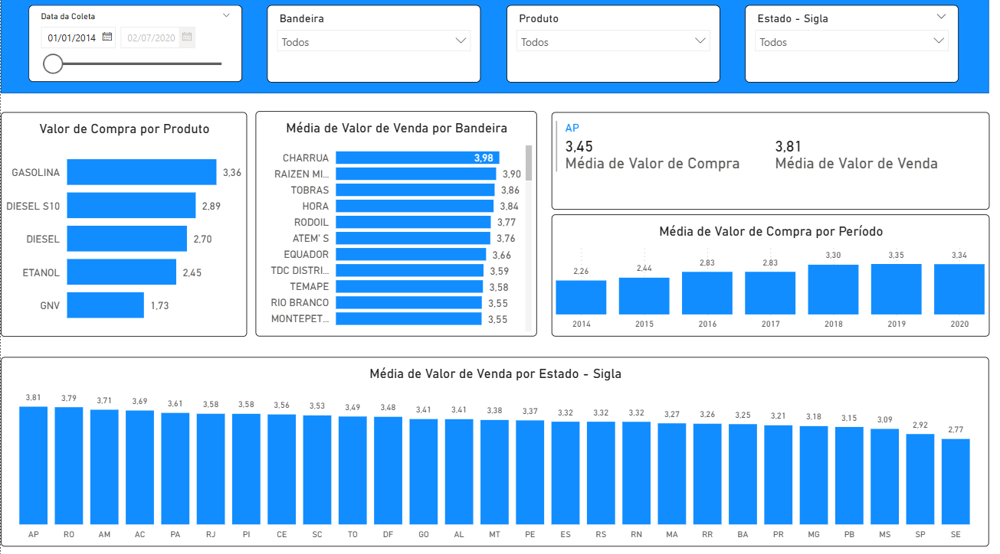

# 📊 Dashboard Combustível

---

## 📌 Sobre o Projeto
Este repositório contém um dashboard interativo desenvolvido no Power BI, com foco na análise de preços de combustíveis no Brasil.  
O projeto simula um cenário real com base em dados públicos e foi criado com o objetivo de fornecer insights relevantes para o setor de distribuição e revenda de combustíveis.

Utilizando **Power Query** para o tratamento dos dados, **DAX** para a criação de medidas analíticas e **modelagem de dados**, o dashboard permite uma análise clara, visual e objetiva.

---
## 🔍 Perguntas Respondidas no Projeto  

- Qual o valor médio de venda de gasolina por **região**?  
- Quais os **valores de compra por produto**?  
- Qual a **variação média dos preços de venda** entre as diferentes **bandeiras**?  
- Como foi a **evolução dos preços médios de compra ao longo do tempo por região**?  
- Qual o **estado** que apresenta o **maior valor de compra e venda**?

---

## 🚀 Tecnologias Utilizadas
- **Power BI Desktop**  
- **Power Query** (ETL – Extração, Transformação e Carga)  
- **DAX (Data Analysis Expressions)**  
- **Modelagem de Dados**

---

## 📂 Estrutura do Repositório
- `Dashboard - Combustivel.pbix` → Arquivo principal do dashboard (abrir no **Power BI Desktop**)  
- `Combustivel.png` → Imagem prévia do dashboard  

---

## 📈 Relatório

### 🔹 Dashboard Combustível

---

## 🔎 Como Utilizar
1. Baixe o arquivo `Dashboard - Combustivel.pbix`  
2. Abra no **Power BI Desktop**  
3. Explore os relatórios de forma interativa  

---
✍️ Desenvolvido por **Patrícia Rocha**  

